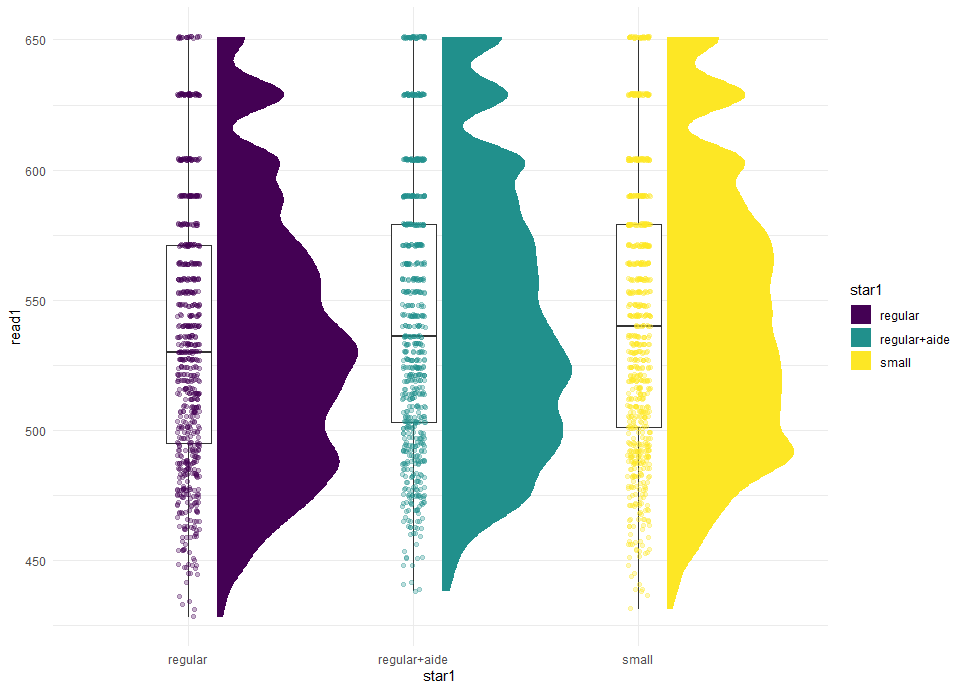

<!--progressive: true = reader can't see the beyond the current 3rd header (###) without "completing" the shown exercises
    allow_skip; true = reader can skip doing the exercise if they want by clicking "continue" --> 
    
    
```{r setup, include=FALSE}
knitr::opts_chunk$set(echo = FALSE, warning = FALSE, message=FALSE)

#to run this tutorial put in the console: rmarkdown::run("./ggplot_tutorial/ggplot_tutorial.Rmd")

library(learnr)
library(tidyverse)
library(ggplot2)
```


## Introduction to ggplot

### What is ggplot2 and what to expect

`ggplot2` is an `R` package used to make data visualisations easier. It allows you to make a variety of graphs quickly, but also allows you to improve existing graphs and editing the aesthetics of your graphs.


 In this tutorial you will learn:

> - the basic structure to making `ggplot2` graphs
> - how to make several different graph types with examples
> - additional options to edit and improve your graphs


The concepts are explained through text and images, the exercises included in this tutorial will help you to test and improve your understanding. When doing the coding exercises, you can also use the hints to help you.


This is just a guide for you to start with `ggplot()`, but you can play with the functions outside of what is suggested in this tutorial. If you want to know more about any function in R, to see additional options, you can google it or type `?` followed by the function name in the Console.

### The data
 
 The dataset we will be using is the star data set, it captures a number of measures concerning class size, students' maths and reading scores and other factors during early school grades. You can find the codebook through this link: https://www.rdocumentation.org/packages/AER/versions/1.2-9/topics/STAR
 
```{r data read in, include=FALSE, eval=TRUE}
#star <- readr::read_csv("https://drmankin.github.io/disc_stats/star.csv")

#star <- readr::read_csv("data/star.csv")

#star <- dplyr::select(starts_with())

star <- tutorials::star
```

To get an idea of the data, let's have a look at it. The data is save in `star`.
```{r datacheck, exercise=TRUE}

```

```{r datacheck-hint}
#to view a data set you can enter its name and run it.
star

#to get an overview of all the variable and classes, you can use the summary() function
summary(star)

```

Now we are almost ready to go, we just need to install `ggplot2`, you only need to do this once on you device and can use this code: `install.packages("ggplot2")`.

## General ggplot use

### The basic structure to make a graphs using `ggplot2::ggplot()`

```{r ggplot_structure, include = TRUE}


#
```

All basic `ggplot` graphs can be built with the structure shown above.


> - The first line setting up the ‘canvas’ for your graph to be mapped onto.
> - The second line allows you to add a layer and define how you want your data to be represented (by a scatterplot, histogram or other.)
> - In the third line you can add additional layers, e.g. other types of data representations or error bars. But you can also add or change the title of your graph, the axis labels, edit the axis scales and much more.
> - Lastly you can add a theme to your graph, which allows you to change the look of the overall graph.  


#### Building the first graph

We will start by building a scatterplot to visualise the relationship between maths scores in the first grade and maths scores in the second grade. Let us try to replicate this plot below - we will go step by step together: 

```{r scatterplot_example, include=TRUE}

```

Every time we can start working on our graphs we have to make sure to have loaded the package `ggplot2`, do you remember how to do this?

```{r load_ggplot, exercise = TRUE}


```

```{r load_ggplot-solution}
#to load any package use the library function
#library(package_name)

library(ggplot2)


```


We will start by making our "canvas", we do this by using the "setup line" of code from the ggplot structure. Don't forget you can use the hints if you feel stuck or don't know how to start. 

```{r canvasmaking, exercise = TRUE}


```

```{r canvasmaking-hint-1}
#we will start with our ggplot function and fill in the missing bits
ggplot2::ggplot(data = data_name, aes(x = varaible1_name, y = variable1_name))
```

```{r canvasmaking-hint-2}
#Our data set is called star, so we will specify that data = star
ggplot2::ggplot(data = star, aes(x = varaible1_name, y = variable1_name))
```

```{r canvasmaking-hint-3}
#we have to decide which variable we want to map onto the x-axis (variable1) and which one we want to map onto the y-axis (variable2). 

#Got back to the codebook to decide which variable were use for the example plot.

#we are looking for variables representing "total math scaled score in 1st grade." and "total math scaled score in 2nd grade."

ggplot2::ggplot(data = star, aes(x = varaible1_name, y = variable1_name))
```

```{r canvasmaking-solution}
#this will be our code to setup our graph
ggplot2::ggplot(data = star, aes(x = math1, y= math2))
```

As you can see, so far we have created a canvas for `R` to now represent out data on. So lets move to adding to our masterpiece.

### Adding layers or `geom_` 

We can add layers to this, by using `geom_` functions we tell `R` how we want the relationship between out variables to be represented, for example in a line, a scatterplot, or a violin plot. 

For this axample we will be using `geom_point()`, we do not need to add any arguments to this function, but pay attention to how we connect the functions used to make a ggplot. 

```{r geom_point, exercise = TRUE}
ggplot2::ggplot(data = star, aes(x = math1, y= math2))


```

```{r geom_point-hint-1}
#we do not need to add any arguments to the geom_point() function, but if we run the code below the setup line and the geom_point function are not connected. 

#go back to the ggplot structure to see how we connect functions when working in ggplot

ggplot2::ggplot(data = star, aes(x = math1, y= math2)) 
  geom_point()
  
```

```{r geom_point-hint-2}
#To connect funcitons in ggplot, we use a +, not a pipe function

ggplot2::ggplot(data = star, aes(x = math1, y= math2)) +
  geom_point()

```


As you can see, you have made a graph! Now we will just have a look on how to change the axis labels and the theme. 

### Axis labels

To change axis labels we use a function called `labs()`. This function can change the graph labels in many ways, chnaging the title, subtitle etc. (have a look at the help document by executing `?labs()` if you are interested).

Its structure: 

```
labs(x = "Text for the label of the x-axis", y = "Text for the label of the y-axis")
```

We will be using `labs()` to change the labels of out axis, since the variable names `math1` and `math2` are not very informative to anyone else, or future you. So let's change them to match the example plot. 


```{r labs, exercise = TRUE}

ggplot2::ggplot(data = star, aes(x = math1, y= math2)) +
  geom_point()


```

```{r labs-hint-1}
#first we have to "connect" the labs function to the rest of or graph, as in the last excercise we do this with a +

ggplot2::ggplot(data = star, aes(x = math1, y= math2)) +
  geom_point() +
  labs()

#now we can define our arguments
```

```{r labs-hint-2}
#in labs() you can assign the x- and y-axis new names by defining them with x = and y =

ggplot2::ggplot(data = star, aes(x = math1, y= math2)) +
  geom_point() +
  labs(x = "x-axis_label", y = "y-axis_label")

#now all that is left to do is to fill in the labels

```

```{r labs-solution}
#solution
ggplot2::ggplot(data = star, aes(x = math1, y= math2)) +
  geom_point() +
  labs(x = "Total math scale score in 1st grade", y = "Total math scale score in 2nd grade")


```

Brilliant! Now we have a graph showing us the pattern between the variables `math1` and `math2` in a meaningful way and is understandanble for others. 

Time to add the theme to our graph to make it look the way we want! 

### Themes 


There many themes to choose from, you can beginn typing `theme_` in RStudio and will be many options to choose from, each og those defines things such as colour of your graph, sizes of the parts of it etc. 

In this case we will be using `theme_minimal`, again, we do not need to specify any arguments in this function, but have to connect it to the rest of the ggplot code. 

```{r theme_minimal, exercise = TRUE}

ggplot2::ggplot(data = star, aes(x = math1, y= math2)) +
  geom_point() +
  labs(x = "Total math scale score in 1st grade", y = "Total math scale score in 2nd grade")


```

```{r theme_minimal-solution}
#and again we are adding a + 
#solution

ggplot2::ggplot(data = star, aes(x = math1, y= math2)) +
  geom_point() +
  labs(x = "Total math scale score in 1st grade", y = "Total math scale score in 2nd grade") +
  theme_minimal()

```


Now we have our plot, it is nice to read, our axis labels help anyone understand what it represents and we have changed its look with a theme. 

This structure will allow you to make many different kinds of plots, for example by changing the `geom_` you can choose what type of graph you want. 

In the following parts of this tutorial you can learn how to make a bargraph, violinplot, a Boxplot and a raincloud plots to try and combine what you have learnt. We will also go over tricks like changing the colours of your graph, changing the scale limits of the x- or y-axis or splitting your graph by variables. 

## Bargraphs and colours

### The basics off a bargraph

Now that we had a look at the basic structure of `ggplots` lets try out some new things. 

First we will try to make a bargraph showing how many people in first grade where in each type of STAR class type (regular, regular with aid or small). 

Our end goal is to make a graph that will look like this: 

```{r}

```

First we will make a bargraph with the variable star1 at the x-axis, but in this case we do not need to define a variable on the y-axis since it signifies the frequency (so we will just not define a `y =` in the `aes()` function). To make a bargraph use `geom_bar`.

```{r bargraph1, exercise = TRUE}


```

```{r bargraph1-hint}
#we will set up the setup line for our graph and then add the geom_bar

ggplot2::ggplot(data = data, aes(xxxx)) +
  geom_bar()
```

```{r bargraph1-solution}
#solution

ggplot2::ggplot(data = star, aes(x = star1)) +
  geom_bar()
```

Now we have a basic bargraph we will:
-add the label of the x-axis
-change the names of the star class types (you can do this using the `scale_x_discrete()`, google the function or run `?scale_x_discrete()` in the consol to see the help page)
-add a theme to the graph 
 
 
```{r bargraph2, exercise = TRUE}
ggplot2::ggplot(data = star, aes(x = star1)) +
  geom_bar()


```

```{r bargraph2-hint-1}
#we are adding labs() to add our axis labels
#in the scale_x_discrete() function we can reassign names by defining labels = 
#here we are adding theme_minimal, but you can try others as well

ggplot2::ggplot(data = star, aes(x = star1)) +
  geom_bar() +
  labs(xxxx) +
  scale_x_discrete(labels = xxxx)+
  theme_minimal()

```

```{r bargraph2-hint-2}
#solution

ggplot2::ggplot(data = star, aes(x = star1)) +
  geom_bar() +
  labs(x = "Type of STAR class in 1st grade") +
  scale_x_discrete(labels = c("Regular", "Regular with aid", "Small")) +
  theme_minimal()
```


### Adding colour


Now all that is left is adding the colours, we can do this by telling `R` based on which variable we want out graph to be coloured. Here we are colouring the graph based on the star1 variable. We do this by adding `fill = variable_name` to the `aes()` function in out setup line. 

```{r bargraph3, exercise = TRUE}

ggplot2::ggplot(data = star, aes(x = star1)) +
  geom_bar() +
  labs(x = "Type of STAR class in 1st grade") +
  scale_x_discrete(labels = c("Regular", "Regular with aid", "Small")) +
  theme_minimal()


```

```{r bargraph3-solution}
#solution

ggplot2::ggplot(data = star, aes(x = star1, fill = star1)) +
  geom_bar() +
  labs(x = "Type of STAR class in 1st grade") +
  scale_x_discrete(labels = c("Regular", "Regular with aid", "Small")) +
  theme_minimal()


```

In this case, we used the colour to make our graph look more exciting, but you can also use this to deferentiate a variable within an existing data visualisation. For example, in the scatterplot we made earlier, lets colour based on the variable `gender`.

What do you think will happen? 

 Warning

 unless you specify a special shape for the points of `geom_point`, they don't have a "fill", so we need to use `colour =` instead. Everything else stays the same.

 For other graphs: 
 `colour =` allows you to define the outline of a data visualisation
 `fill =` allows you to define what colour the data visualisation will be coloured in with.

```{r scatterplot_colour, exercise = TRUE}

ggplot2::ggplot(data = star, aes(x = math1, y= math2)) +
  geom_point() +
  labs(x = "Total math scale score in 1st grade", y = "Total math scale score in 2nd grade") +
  theme_minimal()

```

```{r scatterplot_colour-solution}

ggplot2::ggplot(data = star, aes(x = math1, y= math2, colour = gender)) +
  geom_point() +
  labs(x = "Total math scale score in 1st grade", y = "Total math scale score in 2nd grade") +
  theme_minimal()
```

You now can easily see the data points split by gender. This can be used with all types of graphs, allowing you to add another dimention to them, but keeping the original representation.


### Viridis package for colour readability and accessibility


<!-- show the viridis package and use on bargraph-->

When working with few colours you can assign colours individually, but when working on more complex data representations it might also be helpfull to use tools to generate a sensible colour pallet. 

The package `viridis` allows you to apply an accessible colour palete to graphs (including ggplot) to make them readable for people with colourblindness. 

To use the package, lets install and load it. 

```{r viridis, exercise = TRUE}


```

```{r viridis-solution}
#remember that you only need to download a package once, but need to load it with the library() function everytime you start a new R session

#install.packages("viridis") 
library(viridis)
```

Now lets use this package on our graph(s). The way we do this is by adding the function `scale_fill_viridis()`. When choosing an option you can pick from a number of different colour grades, which you can have a look a look at on https://cran.r-project.org/web/packages/viridis/vignettes/intro-to-viridis.html.

Choose a colour scale from the option on the site and put it in the function in the following format:

scale_fill_viridis(discrete = TRUE ,option = "choose_option")

We will apply this to our bargraph. 

```{r bargraph_viridis, exercise = TRUE}

ggplot2::ggplot(data = star, aes(x = star1, fill = star1)) +
  geom_bar() +
  labs(x = "Type of STAR class in 1st grade") +
  scale_x_discrete(labels = c("Regular", "Regular with aid", "Small")) +
  theme_minimal()

```

```{r bargraph_viridis-solution}
#in this case we used the scale "viridis" 

ggplot2::ggplot(data = star, aes(x = star1, fill= star1)) +
  geom_bar() +
  labs(x = "Type of STAR class in 1st grade") +
  scale_x_discrete(labels = c("Regular", "Regular with aid", "Small")) +
  scale_fill_viridis(discrete = TRUE ,option = "viridis") +
  theme_minimal()

```

Try to apply this to the scatterplot we have created above as well, *again keep the difference between "colour" and "fill" in mind*. 

Here we will use `scale_colour_viridis()` instead: 

```{r scatterplot_viridis, exercise = TRUE}

ggplot2::ggplot(data = star, aes(x = math1, y= math2, colour = gender)) +
  geom_point() +
  labs(x = "Total math scale score in 1st grade", y = "Total math scale score in 2nd grade") +
  theme_minimal()
```

```{r scatterplot_viridis-solution}
ggplot2::ggplot(data = star, aes(x = math1, y= math2, colour = gender)) +
  geom_point() +
  labs(x = "Total math scale score in 1st grade", y = "Total math scale score in 2nd grade") +
  scale_colour_viridis(discrete = TRUE , option = "viridis") +
  theme_minimal()
```

Amazing! Now you are able to make colourful and readable plots for everyone!

## Violin plots and scale limits

### The basics of Violin plots

Violin plots are a grat way to quickly get an overview of data means and distributions, especially when comparing multiple groups.

So lets make one! Let's start with something like this?

```{r violin_png}

```

We will make a violin plot that shows the total math scale in the 3rd year (y-axis) for each type of STAR class in 3rd year (x-axis). Try to find the `geom_` to make a violin plot, RStudio will give you some suggestions.

Then try to add the axis labeled and change the class names as in the example above.

```{r violin_plot1, exercise = TRUE}

#add this piece of code after your geom_ to add the mean point
stat_summary(fun.y=mean)
```

```{r violin_plot1-hint-1}
#this is the setup line and the geom_violin to make a simple violin plot

ggplot2::ggplot(data = star, aes(x = star3, y = math3)) +
  geom_violin() +
  stat_summary(fun.y=mean) 

#try adding the axis labels, and the class names on the x-axis and a theme
```

```{r violin_plot1-solution}
ggplot2::ggplot(data = star, aes(x = star3, y = math3)) +
  geom_violin() +
  stat_summary(fun.y=mean) +
  labs(x = "Type of STAR class in 3rd year", y = "Total math scale in 3rd year") +
  scale_x_discrete(labels = c("Regular", "Regular with aid", "Small")) +
  theme_minimal()
```

Amazing - another `ggplot` you can do! 

### How to change scale limits

This allows us to have a good look at the mean and distribution of the scores between 500 and 800 points. But lets say we want to know the disctribution on the scale of all possible scores (in this case we will assume any score from 0 to 1000 is possible). When looking at any graphs it is important to keep the scales in mind and into perspective. 

So we will change the scale limits of the y-axis. Luckily there is a function for this called `scale_y_continuous()`: 

`scale_y_continuous(limits = c(low_scale_limit, upper_scale_limit))`

So let's try add this to our violin plot. 

```{r violin_scale, exercise = TRUE}


```

```{r violin_scale-hint}
#we add this code to the previous violin plot code

scale_y_continuous(limits = c( 0, 1000))

```

```{r violin_scale-solution}
#solution

ggplot2::ggplot(data = star, aes(x = star3, y = math3)) +
  geom_violin() +
  stat_summary(fun.y=mean) +
  scale_y_continuous(limits = c( 0, 1000)) +
  labs(x = "Type of STAR class in 3rd year", y = "Total math scale in 3rd year") +
  scale_x_discrete(labels = c("Regular", "Regular with aid", "Small")) +
  theme_minimal()

```

When interpreting data you would read this plot very differently to the previous one.

## Boxplot and facets

### Build a boxplot

A different way to visualise data with a mean and distribution are boxplots. 

Lets make a boxplot showing the relationship between total math scale score in 2nd year (y-axis) and type of STAR class in 2nd year (y-axis). The approache is similar to the violin plot you last created, but with a different geom. 

Try to make a boxplot as described above, add axis labels and group labels for the STAR class types. You know the drill. 

```{r boxplot, exercise = TRUE}


```

```{r boxplot-hint-1}
#we are starting with the setup line and then add the geom_boxplot

ggplot2::ggplot( data = star, aes(x = star2, y = math2)) +
  geom_boxplot(width = 0.2)

#we added width = 0.2 to change the width of the boxes on the plot, this is an example how you can change the look of your plot by specifying in the geom_ function
```

```{r boxplot-solution}
ggplot2::ggplot( data = star, aes(x = star2, y = math2)) +
  geom_boxplot(width = 0.2) +
  labs(x = "Type of STAR class in 2nd year", y = "Total math scale in 2nd year") +
  scale_x_discrete(labels = c("Regular", "Regular with aid", "Small")) +
  theme_minimal()
```

We have now made a boxplot and getting to see that using this ggplot structure allows us to make a wide range of different plots without changing our approache.

### Use `facet_wrap` to split graphs by a variable

We saw that we can add more information to a graph by colouring based on a variable. But sometimes it might be helpful to have the same plot split based on a variable/variable. This would allow us to contrast them and see them side by side. 

This might look something like this: 


```{r}

```

This is the same plot we just made, but split into two by the gender, showing the data for female and male students side by side. 

It looks like a lot of work to do this twice, right? Again, luckily someone else did the work for us and made a function called `facet_wrap()`:

You use it by specifying the variable you want to split the graph by (here we will do it by gender):

`facet_wrap(vars(variable_to_split))`

All we need to do is add this function to our graph from before: 

```{r boxplot_facet, exercise = TRUE}

ggplot2::ggplot( data = star, aes(x = star2, y = math2)) +
  geom_boxplot(width = 0.2) +
  labs(x = "Type of STAR class in 2nd year", y = "Total math scale in 2nd year") +
  scale_x_discrete(labels = c("Regular", "Regular with aid", "Small")) +
  theme_minimal()
```

```{r boxplot_facet-hint}
#let us add the new function after our geom_

#now replace "variable_to_split" by the name of the variable we chose to split our graph by

ggplot2::ggplot( data = star, aes(x = star2, y = math2)) +
  geom_boxplot(width = 0.2) +
  facet_wrap(vars(variable_to_split)) +
  labs(x = "Type of STAR class in 2nd year", y = "Total math scale in 2nd year") +
  scale_x_discrete(labels = c("Regular", "Regular with aid", "Small")) +
  theme_minimal()
```

```{r boxplot_facet-solution}

ggplot2::ggplot( data = star, aes(x = star2, y = math2)) +
  geom_boxplot(width = 0.2) +
  facet_wrap(vars(gender)) +
  labs(x = "Type of STAR class in 2nd year", y = "Total math scale in 2nd year") +
  scale_x_discrete(labels = c("Regular", "Regular with aid", "Small")) +
  theme_minimal()

```

Amazing! Now that we have a good number of fun graphs we can make to understand our data, let's do something to combine them and make it even more exciting!

## Raincloud plots

### Let's put it all together

We all saw it coming, now that we have had a look at all the basic building blocks of raincloud plots, we have to combine them! 

If you haven't had the pleasure of meeting these graphs, below is the example we will be making: 

```{r raincloud_png}

```

Exciting, isn't it? But lets start by getting a new tool, the package `ggdist`- if you haven't so already install this package and load it. 

```{r load_ggdist, exercise = TRUE, exercise.eval = TRUE}
#install.packages("ggdist")

library(ggdist)

```

Now lets go!

First, we will make a black and white version of the graph above, it will consist of the following:

-our setup line
-ggdist::stat_halfeye()
-geom_jitter() (this is a type of geom showing data as points)


We will just put these together and see what it looks like before then tweeking everything in place: 

```{r raincloud1, exercise = TRUE}


```

```{r raincloud1-hint}
#fill in the setup line by adding the argument to the aes() function
ggplot2::ggplot( data = star, aes(xxxx)) +
  ggdist::stat_halfeye() +
  geom_boxplot() + 
  geom_jitter()
```

```{r raincloud1-solution}
#Solution
ggplot2::ggplot( data = star, aes(y = read1, x = star1)) +
  ggdist::stat_halfeye() +
  geom_boxplot() + 
  geom_jitter()
```

We have now added all the elements, but still need to move them around a little to make it look like rainclouds. We will do this by changing some arguments within the `ggdist::stat_halfeye()` function, `geom_boxplot()` and `geom_jitter()`. 

Below are some arguments that allow you to change the appearance of the graph, if you want play around with them and see what happens. The solution will give an option that woulds well for the current plot.


```{r raincloud2, exercise = TRUE}

ggplot2::ggplot( data = star, aes(y = read1, x = star1)) +
  ggdist::stat_halfeye(aes(fill = star1), adjust = xx, width = xx, .width = xx, justification = xx, point_colour = NA) +
  geom_boxplot(width = xx, outlier.shape = NA) + 
  geom_jitter(aes(colour = star1), width = xx, alpha = xx)

```

```{r raincloud2-solution}

ggplot2::ggplot( data = star, aes(y = read1, x = star1)) +
  ggdist::stat_halfeye(aes(fill = star1), adjust = .5, width = .7, .width = 0, justification = -.2, point_colour = NA) +
  geom_boxplot(width = .2, outlier.shape = NA) + 
  geom_jitter(aes(colour = star1), width = .05, alpha = .3) 

```

Let's add some viridis functions and a theme to the plot: 

```{r raincloud3, exercise = TRUE}
#these are function you could use for this plot, with the colour scale viridis - as you know you can change the collour scale still


scale_colour_viridis(discrete = TRUE , option = "viridis") +
  scale_fill_viridis(discrete = TRUE , option = "viridis") 


```

```{r raincloud3-hint}

ggplot2::ggplot( data = star, aes(y = read1, x = star1)) +
  ggdist::stat_halfeye(aes(fill = star1), adjust = .5, width = .7, .width = 0, justification = -.2, point_colour = NA) +
  geom_boxplot(width = .2, outlier.shape = NA) + 
  geom_jitter(aes(colour = star1), width = .05, alpha = .3) + 
  scale_colour_viridis(discrete = TRUE , option = "viridis") +
  scale_fill_viridis(discrete = TRUE , option = "viridis") +
  theme_minimal()

```

Amazing! A raincloud plot, though maybe we can make it a little bit more obvious where the name come from by chaning the axis.

### Switching the axis

Switching the axis around can be quite helpful sometime, but seems very daunting it might seem like you have to change the data structure. But the ggplot universe can help us, with a simple function called `coord_flip()`.

This function lets you also manipulate other things such as axis limits and more, but will will use it to flit the axis, which means no arguments within the function need to be defined.

```{r rainplotaxis, exercise = TRUE}


```

```{r rainplotaxis-solution}

ggplot2::ggplot( data = star, aes(y = read1, x = star1)) +
  ggdist::stat_halfeye(aes(fill = star1), adjust = .5, width = .7, .width = 0, justification = -.2, point_colour = NA) +
  geom_boxplot(width = .2, outlier.shape = NA) + 
  geom_jitter(aes(colour = star1), width = .05, alpha = .3) + 
  scale_colour_viridis(discrete = TRUE , option = "viridis") +
  scale_fill_viridis(discrete = TRUE , option = "viridis") +
  coord_flip() +
  theme_minimal()

```


Amazing - now you have made some awesome plots and hopefully gotten to know `ggplot` a little. 

But remember there are so many other fun things you can do with `ggplot`, so keep exploring! 


Referencces: 

https://z3tt.github.io/Rainclouds/


